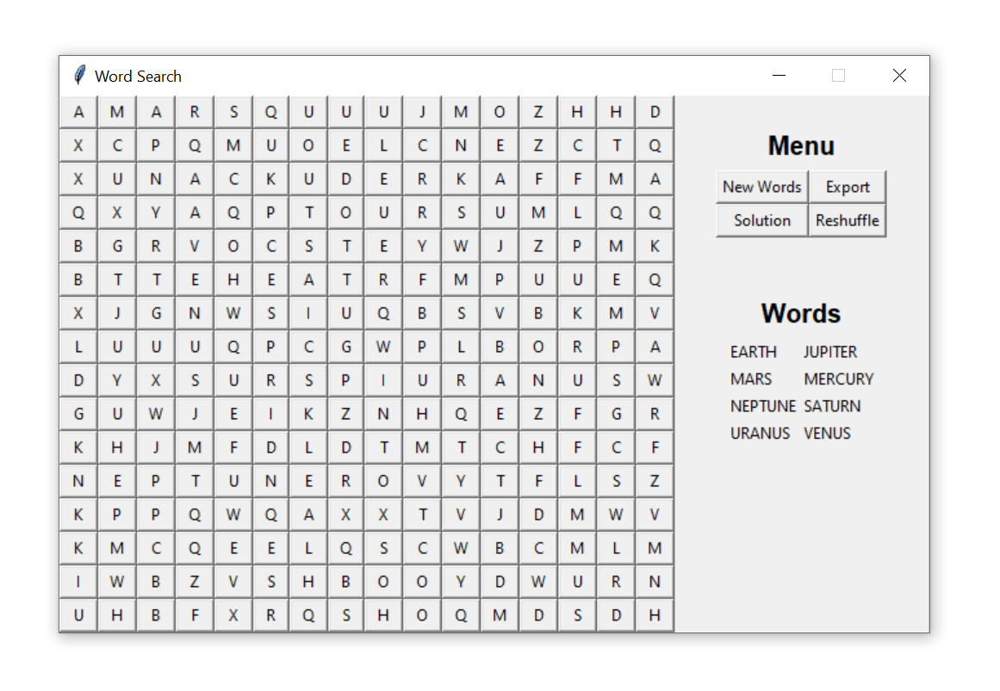
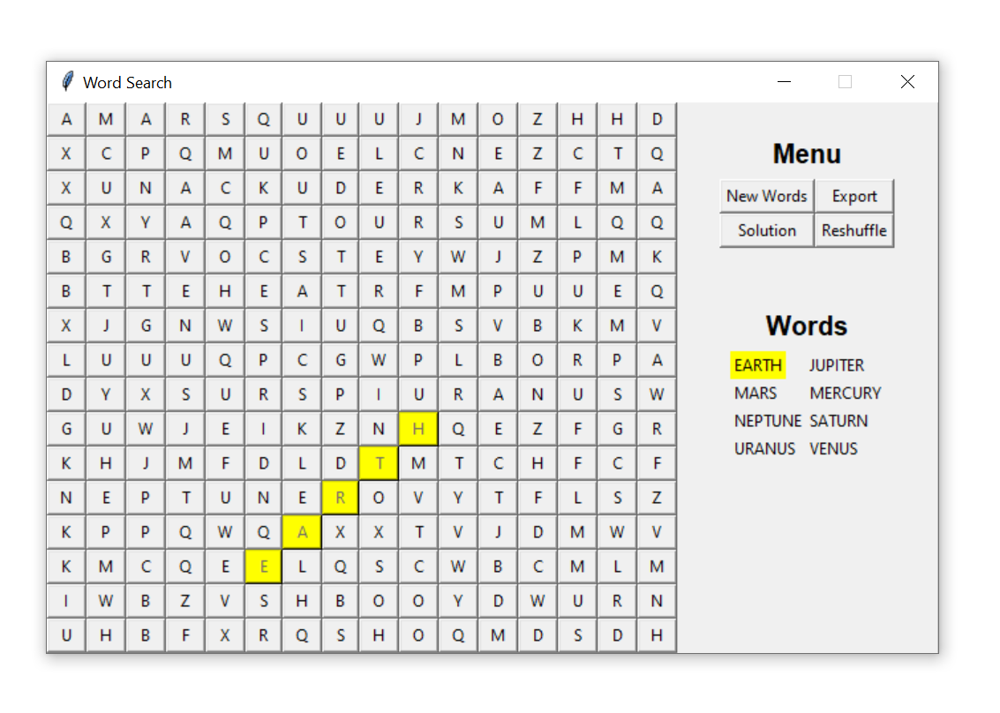
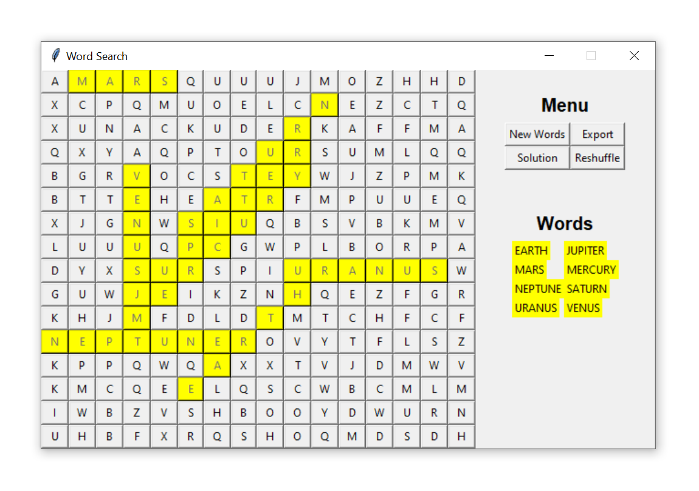
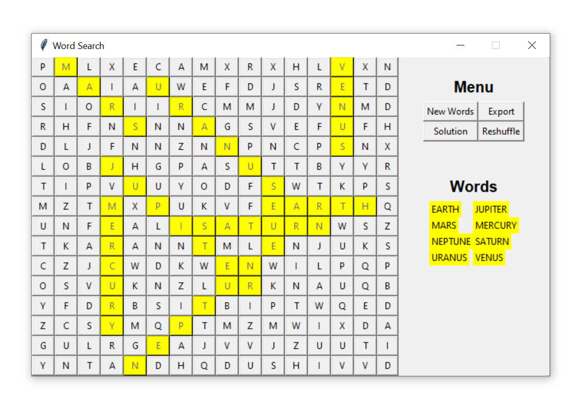
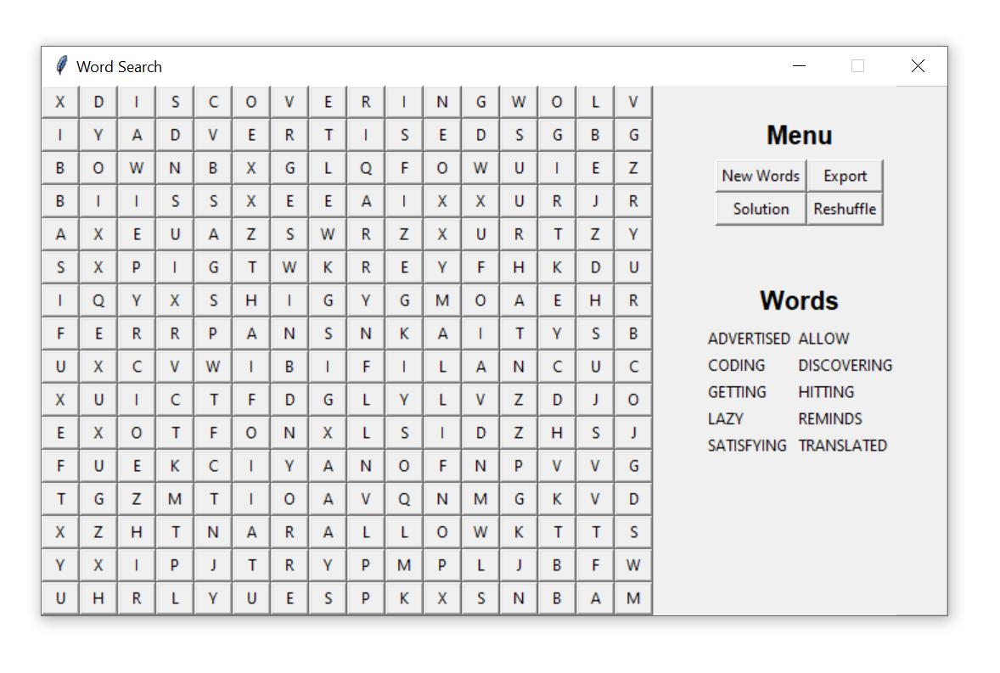
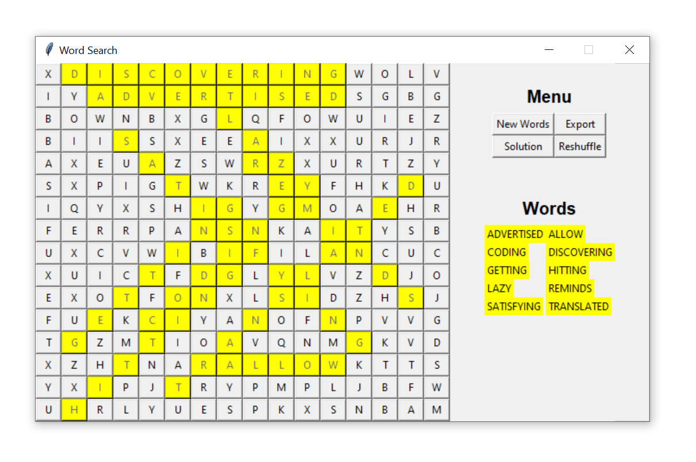

# Word Search

This program creates Word Searches.

Blank Word Search | Word Search Partially Filled Out
:---: | :---:
 | 
**Word Search with Solution Shown** | **Word Search with Words Reshuffled**
 | 
**Word Search with New Random Words** | **New Random Words Solution Shown**
 | 

## Usage

`cd` into the directory containing these scripts and run
<br>

```
python console.py
```

<br>

The following is an example of the console output:

<br>

```
Welcome to the WordSearch creator!
This program creates Word Search Puzzles.

The menu has four buttons which perform the following functions:
        1. New Words: Generate a new random set of words to search for.
        A text file containing words separated by newline characters called words.txt must be present in the current directory in order for this feature to work.
        2. Export: Creates a .html file containing the current Word Search grid as a HTML table, LaTeX Matrix and a String
        3. Solution: Show the location of each word on the Word Search board. Toggles on/off
        4. Reshuffle: Creates a new Word Search grid with the same words in new positions

Click the buttons on the grid corresponding to the found word to "find" words

Defaults -> Size: 16x16, Color: Yellow
If you'd like to change the defaults, enter the desired values in the prompts below:
Size (Return/Enter for Default):
Check valid color options here: http://www.science.smith.edu/dftwiki/index.php/Color_Charts_for_TKinter
Entering an invalid color option will break the program.
Color (Return/Enter for Default):
If you'd like to add a custom word list to replace words.txt, place the file in this directory and enter the file name below. Make sure words are separated by newline characters:
New Words File Name (Return/Enter for Default):
If you'd like to create a customized Word Search, enter the words below, one at a time:
Next Word (Return/Enter to Quit/Stop): Mercury
Next Word (Return/Enter to Quit/Stop): Venus
Next Word (Return/Enter to Quit/Stop): Earth
Next Word (Return/Enter to Quit/Stop): Mars
Next Word (Return/Enter to Quit/Stop): Jupiter
Next Word (Return/Enter to Quit/Stop): Saturn
Next Word (Return/Enter to Quit/Stop): Uranus
Next Word (Return/Enter to Quit/Stop): Neptune
Next Word (Return/Enter to Quit/Stop):
```

## Exporting

The Word Search boards can be exported as a `.html` file containing an `html` table of the Word Search grid, a LaTeX matrix version of the Word Search grid, and the word search grid as a String. The solution is also in the `html` file. See `WordSearch.html` in this directory to see an example of this.

## Dependencies

* [Python 3.7+](https://www.python.org/)